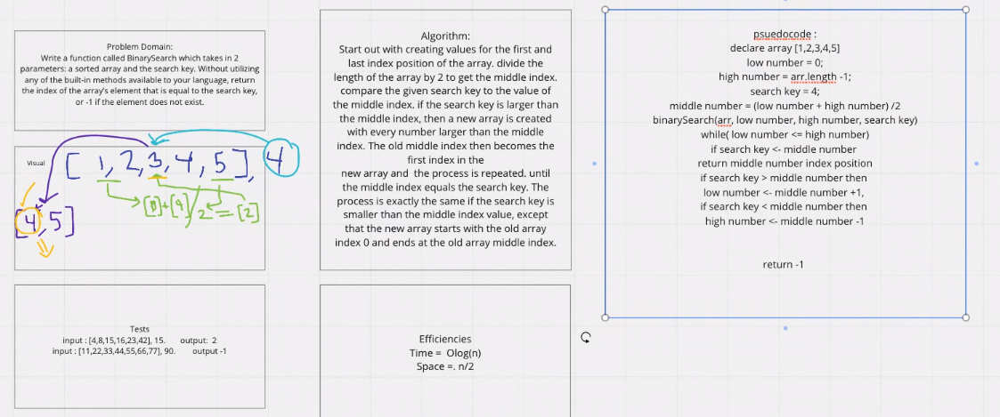
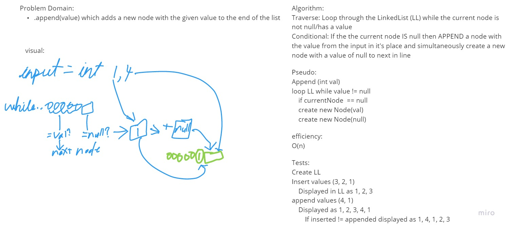
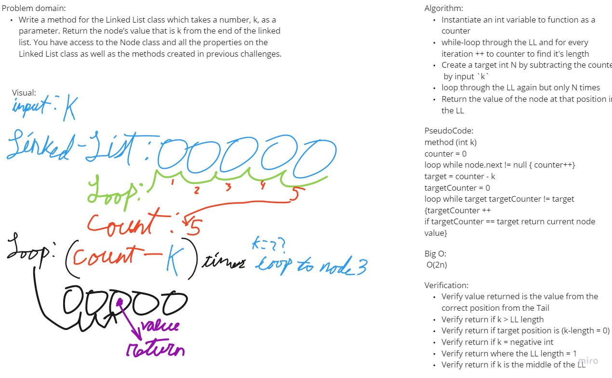
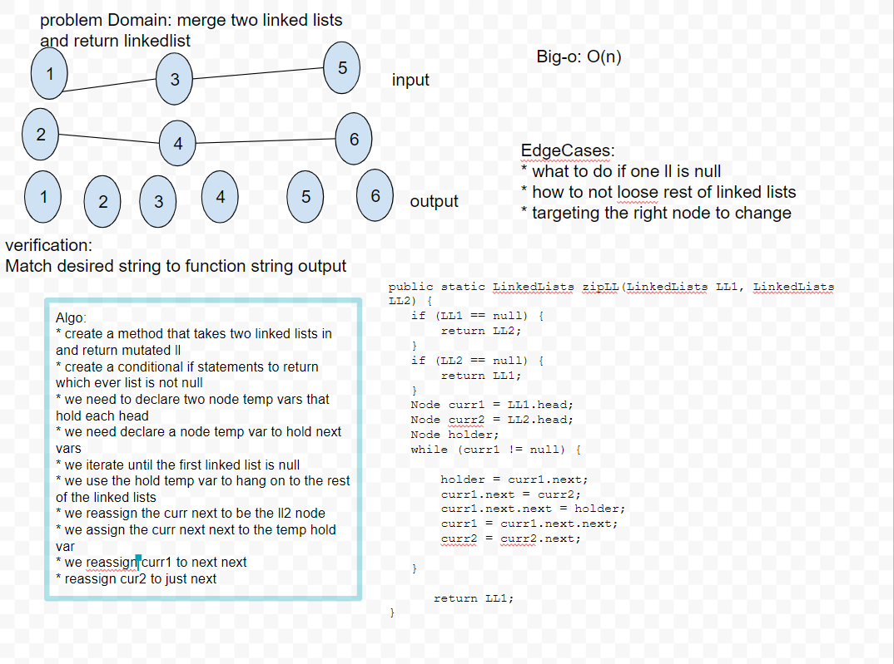

# Data Structures and Algorithms

# Language: `Java`

## Table of Contents

Challenge | Code
----------|-----
Challenge 01 | [Array Reversal](lib/src/main/java/challenges/ArrayReverse.java)
Challenge 02 | [Array Shift](lib/src/main/java/challenges/ArrayShift.java)
Challenge 03 | [Binary Search](lib/src/main/java/challenges/BinarySearch.java)
Challenge 05 | [Linked List](lib/src/main/java/challenges/linkedList/LinkedList.java)
Challenge 06 | [Linked List (append/insert)](lib/src/main/java/challenges/linkedList/LinkedList.java)
Challenge 07 | [Linked List (Value from the End)](lib/src/main/java/challenges/linkedList/LinkedList.java)
Challenge 08 | [Zipped Linked List](lib/src/main/java/challenges/linkedList/LinkedList.java)

# Reverse an Array

## Challenge

Write a function which takes an array as an argument. Without utilizing any built-in methods return an array with elements in reversed order.

## Approach & Efficiency

Nested `for` loops, the first taking in the array of numbers and positioning each index as the last index of the empty array, and counting down from the index position with every loop through. The second loop iterates through the newly created and reverse array and prints it to the terminal.

## Solution

Whiteboarding by Matthew Simms, with Andy Agulue and Victor Sullivan

# Shift an Array

## Challenge

Write a function called insertShiftArray which takes in an array and the value to be added. Without utilizing any of the built-in methods available to your language, return an array with the new value added at the middle index.

## Approach & Efficiency

Create a method which takes in an array and a number. Establish the required length of the output array by taking the length of the input array and adding 1. Then find the middle index of that new array by taking that established length and dividing by 2. Then create the output array with the established length. Then iterate over the length of that output array, and with iterations above and below the middle index, insert the values of the original array, and where the index matches the middle index insert the number the method takes in as an argument.

## Solution

Whiteboarding by Barrett Nance with Matthew Simms

# Binary Search

## Challenge

Write a function called BinarySearch which takes in 2 parameters: a sorted array and the search key. Without utilizing any of the built-in methods available to your language, return the index of the array’s element that is equal to the search key, or -1 if the element does not exist.

## Approach & Efficiency

Created a method which takes as input a sorted `array` of ints, and an int `key` to be used as a search term.
Method instantiates a `low` value of 0 and a `high` value created from the length of the `input array -1`
Created `while loop` that runs while the `low` number is less than or equals to the `high` number. upon each iteration of the loop a `mid` point is calculated by summing the `low` and `high` values and dividing them by 1. Next it checks if the input `key` is equal to the value at the `mid` position of the input `array`. If so, the loop ends and that mid position value is returned. If not, the loop checks if the `key` is greater than the value at the `mid` position of the `array`. If so, it changes the `low` value by +1 to it and reiterating the loop. Otherwise the high value has it's value set to the mid value -1. If the key never finds it's match in the loop, it exits and returns -1.

## Solution

Whiteboarding by Matthew Simms with Matthew Simms

# Singly Linked List

## Challenge

Create a Node class that has properties for the value stored in the Node, and a pointer to the next Node. Within your LinkedList class, include a head property. Upon instantiation, an empty Linked List should be created.

- Define a method called insert which takes any value as an argument and adds a new node with that value to the head of the list with an O(1) Time performance.
- Define a method called includes which takes any value as an argument and returns a boolean result depending on whether that value exists as a Node’s value somewhere within the list.
- Define a method called toString (or __str__ in Python) which takes in no arguments and returns a string representing all the values in the Linked List, formatted as:
"{ a } -> { b } -> { c } -> NULL"

## Approach & Efficiency

I have absolutely no clue about the space/time efficiency in any aspect. I don't remember covering it in class, and I guess that's my home work for the weekend.

## API
<!-- Description of each method publicly available to your Linked List -->
- Insert method that receives an int as input. Creates a new node at the position of head that carries the input value. If statement checks if the tail position is null, and if so creates another head in the list and assigns it a the value.
- Includes method takes in an int, and loops for as long as the current node is null. If the input value matches the value of the current node then the method returns true. If not, the loop tests the next node in the list. When the loop runs out of nodes to check and has not found it's match it returns false.
- toString method takes in no arguments. It creates an empty string to serve as a vessel, and loops through the nodes in the list and adds the node values along with string concatenation for formatting to the empty string , and then returns the now filled string.

# Append/Insert Linked List

## Challenge

Write the following methods for the Linked List class:

- .append(value) which adds a new node with the given value to the end of the list
- .insertBefore(value, newVal) which add a new node with the given newValue immediately before the first value node
- .insertAfter(value, newVal) which add a new node with the given newValue immediately after the first value node

## API

## Solution

Whiteboarding by Matthew Simms with Matthew Simms

# k-from-end LL

## Challenge Description

Write a method for the Linked List class which takes a number, k, as a parameter. Return the node’s value that is k from the end of the linked list. You have access to the Node class and all the properties on the Linked List class as well as the methods created in previous challenges.

## Approach & Efficiency

The whiteboard is a bit outdated after a bit of coding.

- Method takes in an integer `k` and returns the value of the node that is `k` nodes from the end of the Linked List
- instantiated a counter that starts at 1
- While-Looped through the LL and for every iteration I added 1 to the counter
- Added a conditional so that if `k` is negative the loop would break and return an Exception
- instantiated a second counter starting at 1, and a Target int that would take the counter from the previous loop and subtract `k` from it and add 1 to that.
- While-looped again through the LL and for every iteration adding 1 to the new counter.
- conditionals check if the Target variable equals the Counter, and if so returns the value of that node that is `k` places from the end.
- or if the target is 0 then it returns that node value.
- If the conditionals are never met and then the method returns a zero and a statement

## Solution

# Reverse an Array

## Challenge

Write a function called zipLists which takes two linked lists as arguments. Zip the two linked lists together into one so that the nodes alternate between the two lists and return a reference to the head of the zipped list. Try and keep additional space down to O(1). You have access to the Node class and all the properties on the Linked List class as well as the methods created in previous challenges.

## Approach & Efficiency

CREDIT TO JOSEPH FOR THE LOGIC this is not my solution, but what was explained to me.

First area pair of checks to see if either Linked List (LL) is null, and if so it returns the other. Creates two variables, each representing the head of each LL, and creates an empty HOLDER variable to hold/clone values while another value takes it's place in the LL.
While-loop through the first LL for as long as it is not null. Assign the NEXT value of the current node to the holder variable, and assign the head value of the second LL to it's position instead. Then the next-NEXT position from the head assumes the value of the holder, previously second in line from the first LL and the second LL iterated to the next value and the loop repeats.

When the loop finished (when the value is null) the first LL, now zipped, is returned.

## Solution

Whiteboarding by Joseph, with Andy Agulue

