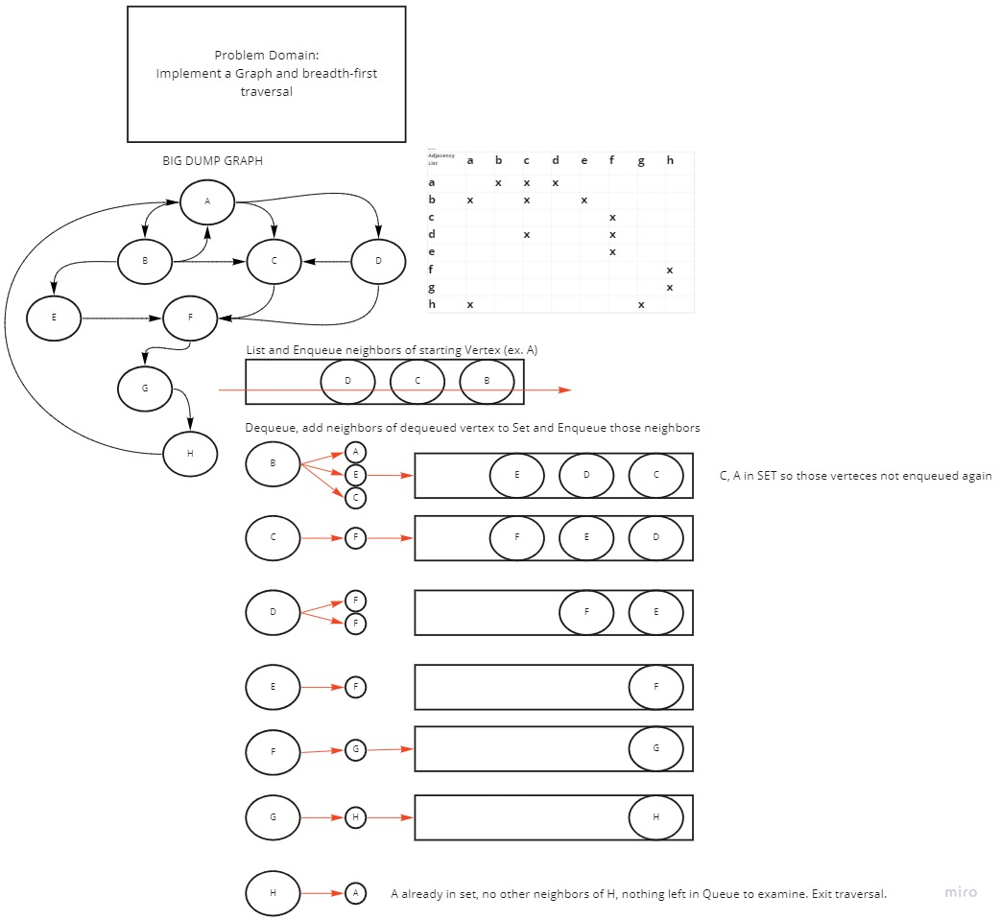

# Graphs

## Breadth First Traversal

Add starting vertex and all neighboring verteces to Set and Enqueue all neighbors.
Dequeue, and if neighbors of dequeued vertex are not in Set then enqueue them.
Process dequeueing verteces and checking for un-set neighboring verteces continues until the queue is empty and the final vertex has no new neighbors. 

